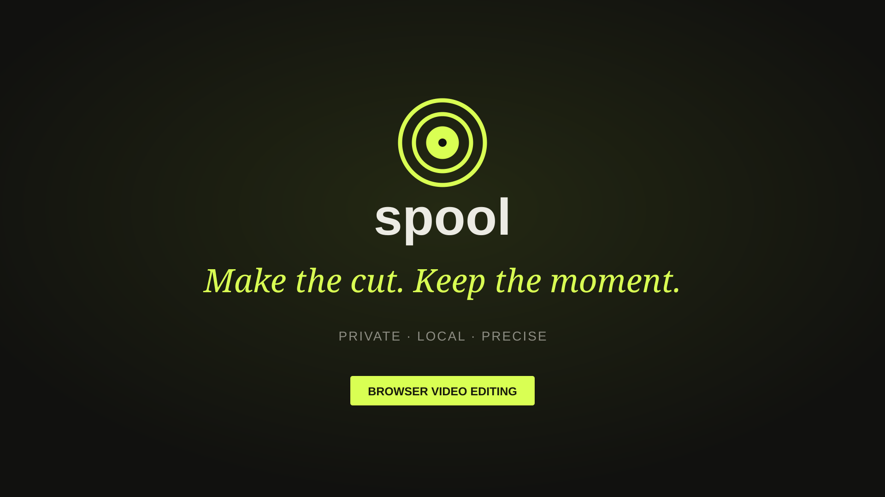

# Spool

> A private, local-first video editor for short demos and social clips.

Spool is a desktop-focused browser video editor built with React, TypeScript, and FFmpeg.wasm. Media stays on the user's device: there is no application backend, account system, cloud upload, or paid processing API.

## Demo

[](./demo/spool-demo.mp4)

Click the image to watch the 14-second Spool demo, featuring the real editor populated with a locally generated test clip.

Regenerate it at any time with:

```bash
npm run demo
```

The demo script creates synthetic media, launches the local app, captures the populated editor, and produces a verified 1080p H.264/AAC MP4. It does not use personal media or upload anything.

The project is being built from the export path outward. The current milestone is a functional export lab that imports a local video, makes a precise trim, and encodes a downloadable MP4 entirely in the browser.

## Why Spool?

Most web video tools begin by uploading your footage. Spool takes a different approach:

- **Private by default** — imported media and export processing remain local.
- **Useful before flashy** — export correctness comes before decorative editor controls.
- **Clear limits** — the UI reports unsupported inputs and resource constraints honestly.
- **Replaceable media engine** — FFmpeg-specific behavior is isolated behind a service boundary.
- **Preview/export parity** — the editing model is designed so the final file matches what the editor shows.

## Current state

Milestone 0 is implemented as a runnable vertical slice.

### Working now

- Local video import with browser metadata validation
- 250 MB input guardrail and 60-second output limit
- Numeric start and end trim controls
- Locally generated eight-frame filmstrip for visual trimming
- Draggable frame-grid In/Out handles and clickable timeline seeking
- Looped selection preview with previous/next frame controls
- Keyboard editing shortcuts: `I`, `O`, arrow keys, and Space
- Self-hosted, single-threaded FFmpeg.wasm runtime
- Precise decode-and-reencode trimming
- Landscape MP4 output at 1280 × 720 and 30 fps
- Landscape, portrait, and square output presets with live preview framing
- Selectable canvas colours that carry through to the exported letterbox area
- H.264 video with optional AAC source audio
- Contain-fit framing with a solid background
- Measured encoder progress and explicit export stages
- Cancellation by terminating the active media engine
- Clean engine recreation when retrying after cancellation
- Independent playback and download of the exported file
- Responsive interface with self-hosted fonts

### Not implemented yet

- Multi-clip timeline and media bin (the current precision trimmer handles one source)
- Split, reorder, ripple delete, and undo/redo
- Timed text overlays
- Background music and volume controls
- IndexedDB project persistence
- Full integration fixture and end-to-end browser automation

## Getting started

### Requirements

- A current desktop version of Chrome or Edge
- Node.js 20 or newer
- npm

### Install and run

```bash
npm install
npm run dev
```

Open the local URL printed by Vite, normally <http://127.0.0.1:5173>.

The install step copies the pinned single-thread FFmpeg core into `public/media-engine`. Export therefore has no runtime CDN dependency.

## Available commands

| Command | Purpose |
| --- | --- |
| `npm run dev` | Start the Vite development server |
| `npm run build` | Type-check and create a production build |
| `npm run preview` | Serve the production build locally |
| `npm run typecheck` | Run strict TypeScript checks |
| `npm test` | Run the Vitest suite |

## How the current export works

1. The browser reads the selected video's duration and dimensions.
2. Spool validates the file against the first-release resource limits.
3. The locally hosted FFmpeg core loads in a web worker.
4. The source is copied into FFmpeg's in-memory filesystem.
5. FFmpeg decodes through the selected cut, normalizes framing and frame rate, and encodes an MP4.
6. Spool reads the result into a browser `Blob`, cleans temporary files, and presents an independent player and download link.

Export uses contain-fit scaling; footage is never silently stretched. Video without an audio stream is accepted through optional audio mapping.

## Project structure

```text
spool/
├── public/
│   └── media-engine/       # Self-hosted FFmpeg core and WASM
├── scripts/
│   └── copy-media-engine.mjs
├── src/
│   ├── services/
│   │   └── ffmpegEngine.ts # Engine loading, export, cancel, cleanup
│   ├── App.tsx             # Current export-lab UI and workflow
│   ├── main.tsx
│   └── styles.css
└── vite.config.ts          # Development and production build setup
```

As the editor grows, pure timeline logic will live under `src/domain`, feature UI under `src/features`, and runtime-only media handles will remain separate from the serializable project document.

## Technical choices

| Area | Choice |
| --- | --- |
| UI | React 19 + TypeScript |
| Build | Vite |
| Media processing | `@ffmpeg/ffmpeg` with single-thread `@ffmpeg/core` |
| Icons | Lucide React |
| Fonts | Manrope and DM Mono, bundled locally |
| Unit tests | Vitest |

Single-thread processing is intentional for the first release. It avoids requiring cross-origin isolation and `SharedArrayBuffer` before performance measurements justify the added deployment constraints.

## Browser and resource limits

Spool currently targets modern desktop Chrome and Edge. Browser-based media processing is memory-intensive, and successful export depends on the input codec, dimensions, duration, and available device memory.

Initial guardrails are deliberately conservative:

- Up to 250 MB of imported media
- Up to 60 seconds of edited output
- One export job at a time
- Landscape (1280 × 720), portrait (720 × 1280), or square (720 × 720) output at 30 fps

These are product limits, not guarantees that every file below them will decode successfully.

## Roadmap

1. Verify export with real audio and silent-video fixtures, including cancel/retry.
2. Add the versioned project model and pure timeline operations.
3. Build the media bin, preview transport, and single-track timeline.
4. Add shared text rasterization for preview and export.
5. Add source-audio and background-music mixing.
6. Persist projects and media blobs transactionally in IndexedDB.
7. Complete production deployment and the full two-clip release scenario.

## Verification

Before submitting changes, run:

```bash
npm run typecheck
npm test
npm run build
npm audit --omit=dev
```

Do not treat a mocked engine test as proof that export works. Release evidence must include a real exported fixture played independently from the editor.

## Privacy

Spool does not upload imported video or project content. Files are read by browser APIs and processed by the locally loaded WebAssembly engine. Future local persistence will use IndexedDB rather than placing media or base64 data in `localStorage`.

## Contributing

Keep changes focused on working vertical slices and preserve the local-first architecture. In particular:

- Preserve strict TypeScript boundaries.
- Keep project state serializable and runtime media objects separate.
- Put timeline calculations in pure, tested functions.
- Do not build FFmpeg command strings inside React components.
- Do not add cloud processing, fake exports, or controls without working behavior.
- Prefer correctness and actionable errors over visual polish.

## License

No project license has been selected yet. FFmpeg.wasm and its packaged core retain their respective upstream licenses; review those terms before distributing a production build.
